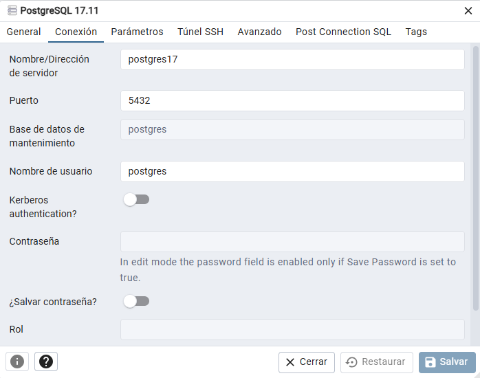
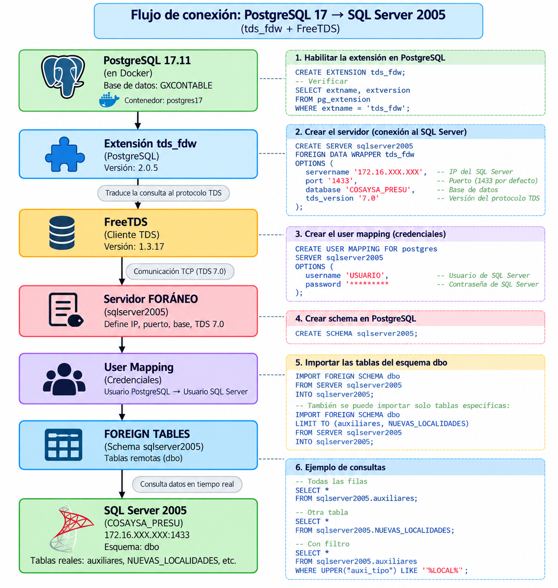
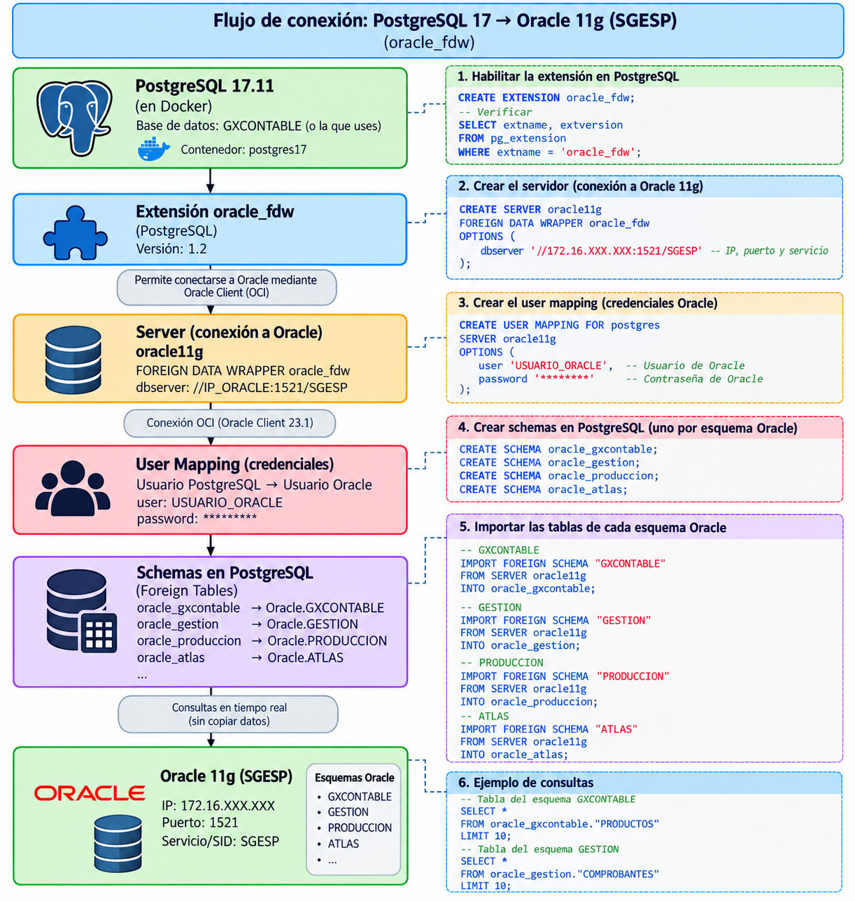

## CREACION DE DOCKER PARA POSTGRESQL 17.11

Para realizar estas pruebas voy a crear contenedores Docker para PostgreSQL y PgAdmin4 con el comando. 
Ubicado en la carpeta donde tengo el archivo .yml

```bash
docker compose up -d
```

Ahora para ver pgAdmin en el navegador usamos con las contraseñas definidas en el archivo .yml:

```bash
http://localhost:5050
```

y hay creamos una nueva coneccion para conectarse al contenedor de PostgreSQL



Donde el usuario **postgres** es el **superusuario** de PostgreSQL. Por lo tanto no voy a tener problemas de permisos para trabajar con PostgreSQL.

## Database Link: PostgreSQL 17.11 → SQL Server 2005

Para esto, entramos a nuestro contenedor con el comando:

```bash
docker exec -it postgres17 bash

docker exec -it -u root postgres17 bash         # para entrar como root
```

Dentro del contenedor ejecutamos:

```bash
cat /etc/os-release
psql --version
apt update
apt-cache search tds-fdw                    #como me devuelve varias filas quiere decir que si tengo este paquete disponible
apt-cache search postgresql | grep -i tds       
```

Ahora estamos en condiciones para instalar **FreeTDS**, para esto usamos el comando:

```bash
apt install -y postgresql-17-tds-fdw freetds-bin freetds-common
tsql -C         # para verificar si se instalo correctamente
```

Ahora podemos probar la coneccion a SQL Server 2005 con el comando:

```bash
TDSVER=7.1 tsql -H 172.16.109.7 -p 3750 -U america      # NO FUNCIONO
TDSVER=7.0 tsql -H 172.16.109.7 -p 3750 -U america     # FUNCIONO DE 10 (para salir usamos exit)
```

Lo que sigue a continuacion lo podemos hacer directamente en pgAdmin. 
(Nos paramos en la base de datos en la que quiero crear el vinculo, en este caso GXCONTABLE)

1. Crean la extencion tds_fdw
Activar en esa base PostgreSQL la extensión tds_fdw que instalamos previamente en el contenedor. 
**tds_fdw** es el componente que permite a PostgreSQL trabajar con bases externas que utilizan el protocolo TDS, como SQL Server 2005.

```sql
CREATE EXTENSION tds_fdw;

-- para verificar si la extencion esta habilitada
SELECT extname, extversion
FROM pg_extension
WHERE extname = 'tds_fdw';
```

2. Crear el servidor SQL Server 2005
Definimos donde esta el SQL Server 2005 remoto y como llegar a él.
```sql
CREATE SERVER sqlserver2005
FOREIGN DATA WRAPPER tds_fdw
OPTIONS (
    servername '172.16.109.7',
    port '3750',
    database 'COSAYSA_PRESU',
    tds_version '7.0'
);
```

3. Crear el User Mapping
Esto relaciona un usuario PostgreSQL con las credenciales que debe utilizar para entrar a SQL Server.
```sql
CREATE USER MAPPING FOR postgres
SERVER sqlserver2005
OPTIONS (
    username 'america',
    password 'CONTRASEÑA_AMERICA'
);
```

4. Creamos el esquema sqlserver2005
Esto crea un schema dentro de PostgreSQL. 
No crea nada en SQL Server. 
Lo estás utilizando como una especie de carpeta lógica donde guardar las definiciones de las tablas externas:
```sql
CREATE SCHEMA sqlserver2005;
```

5. Importamos el esquema
Este es uno de los pasos más importantes.  
Le estás diciendo a PostgreSQL:  
**Mirá las tablas que existen en el esquema dbo del SQL Server definido como sqlserver2005 y creá sus correspondientes definiciones como FOREIGN TABLE dentro del schema PostgreSQL sqlserver2005.**
```sql
IMPORT FOREIGN SCHEMA dbo
FROM SERVER sqlserver2005
INTO sqlserver2005;
```

No está copiando los datos.  
Está creando objetos PostgreSQL que apuntan a las tablas reales de SQL Server.  
Por eso, como vimos antes, **si cambian los datos en SQL Server, los vas a consultar actualizados**. Pero **si cambia la estructura de las tablas, las definiciones de las FOREIGN TABLE no se actualizan automáticamente.**     
Tener en cuenta que cualquier **INSERT**, **UPDATE**, **DELETE** que se realice desde **PostgreSQL** si va a **impactar** en la base de datos **SQL Server2005**.

## Flujo de Conexion Completo




## Database Link: PostgreSQL 17.11 → Oracle 11g

Entramos al contenedor como root:

```bash
docker exec -it -u root postgres17 bash
```
y ejecutamos:

```bash
apt update
apt-cache search oracle-fdw
apt-cache search postgresql | grep -i oracle
```

Ahora podesmos instalar **oracle_fdw** que es una librería de Oracle Client (OCI) que se utiliza para comunicarse con tu Oracle 11g 11.2.0.4

```bash
apt install -y postgresql-17-oracle-fdw

# para ver si se instalo correctamente:
dpkg -l | grep oracle-fdw               
ls /usr/share/postgresql/17/extension/ | grep oracle
ldd /usr/lib/postgresql/17/lib/oracle_fdw.so
```

Lo que sigue a continuacion lo podemos hacer directamente en pgAdmin. 
(Nos paramos en la base de datos en la que quiero crear el vinculo, en este caso GXCONTABLE)

1. Crean la extencion oracle_fdw

```sql
CREATE EXTENSION oracle_fdw;

-- para verificar si la extencion esta habilitada
SELECT extname, extversion
FROM pg_extension
WHERE extname = 'oracle_fdw';
```

2. Crear el SERVER hacia Oracle 11g (PRUGESP) 

```sql
CREATE SERVER oracle11g
FOREIGN DATA WRAPPER oracle_fdw
OPTIONS (
    dbserver '//192.168.110.79:1521/SGESP'
);
```

3. Crear el User Mapping
Esto relaciona un usuario PostgreSQL con las credenciales que debe utilizar para entrar a Oracle11g.
```sql
CREATE USER MAPPING FOR postgres
SERVER oracle11g
OPTIONS (
    user 'GXCONTABLE',
    password 'CONTRASEÑA_GXCONTABLE'
);
```

4. Creamos el esquema oracle11g
Esto crea un schema dentro de PostgreSQL. 
No crea nada en SQL Server. 
Lo estás utilizando como una especie de carpeta lógica donde guardar las definiciones de las tablas externas:
```sql
CREATE SCHEMA oracle11g;
```

5. Importamos el esquema
Este es uno de los pasos más importantes.  
Le estás diciendo a PostgreSQL:  
**Mirá las tablas que existen en Oracle11g definido como Oracle11g y creá sus correspondientes definiciones como FOREIGN TABLE dentro del schema PostgreSQL Oracle11g.**

```sql
IMPORT FOREIGN SCHEMA "GXCONTABLE"
FROM SERVER oracle11g
INTO oracle11g;
```

Ahora podemos ejecutar consultas, por ejemplo:
```sql
SELECT *
FROM oracle11g.productos;

SELECT *
FROM oracle11g.existencias;
```

Y en el caso de que quiera incluir otros esquemas realizamos los import necesarios ya que no se pierden los esquemas sino que se van acumulando.

```sql
-- ESQUEMA DATASTORE5
IMPORT FOREIGN SCHEMA "DATASTORE5"
FROM SERVER oracle11g
INTO oracle11g;

SELECT * FROM oracle11g.RELFUENTES_CATASTROSDGI;

-- ESQUEMA PRODUCCION
IMPORT FOREIGN SCHEMA "PRODUCCION"
FROM SERVER oracle11g
INTO oracle11g;

SELECT * FROM oracle11g.FUENTES_ABASTECIMIENTO;
SELECT * FROM oracle11g.TIPOS_FUENTE;

-- ESQUEMA MANTENIMIENTO
IMPORT FOREIGN SCHEMA "MANTENIMIENTO"
FROM SERVER oracle11g
INTO oracle11g;

select * from oracle11g.M_CENTROCOSTO;

-- ESQUEMA SUELDO
IMPORT FOREIGN SCHEMA "SUELDO"
FROM SERVER oracle11g
INTO oracle11g;

SELECT * FROM oracle11g.CONCEPTOS_RRHH
ORDER BY ID_CONC;


SELECT * FROM oracle11g.EMPLEADOS;
```

**NOTA: EN CASO DE QUE LA TABLA_NRO_1 DEL PRIMER ESQUEMA QUE IMPORTE ESTE EN EL SEGUNDO ESQUEMA A IMPORTAR VA A OCURRIR UN ERROR DE TABLA DUPLICADA, PARA SOLUCIONAR ESTO TENEMOS QUE CREAR OTRO ESQUEMA PARA ESTE IMPORT**

## Flujo de Conexion Completo

