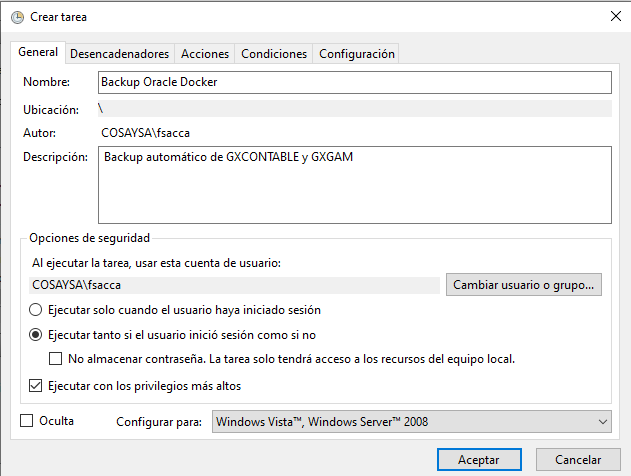
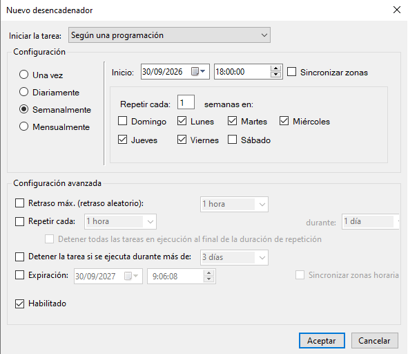
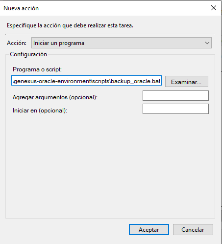
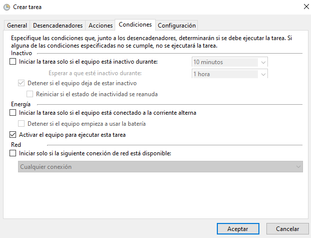
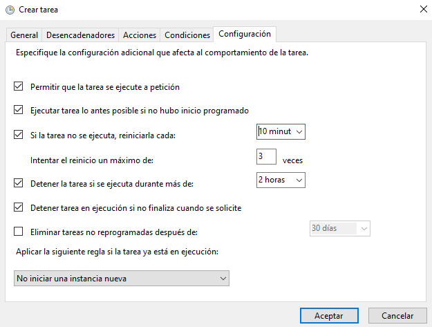
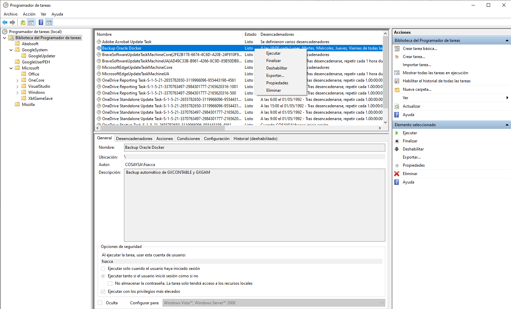

# Automatizacion de Backups de mi base de datos Docker Oracle 11g

Primero ejecutamos:

```bash
docker inspect oracle11g-local
docker inspect oracle11g-local --format "{{json .Mounts}}"
```

esto me dice que ya tengo montada la carpeta backup del host hacia el contenedor:

```bash
Windows:
C:\GustavoMercado\genexus-oracle-environment\backup

        ↕ bind mount

Contenedor:
 /backup
```

Es decir ya tenemos configurada la carpeta donde se van a almacenar los backups, ahora desde dbeaver vemos si existe el directorio y le damos los permisos para poder acceder a los esquemas de los cuales quiero hacer backup:

```sql
SELECT DIRECTORY_NAME,
       DIRECTORY_PATH
FROM DBA_DIRECTORIES
WHERE DIRECTORY_NAME = 'BACKUP_DIR';

-- En caso de que no existe, lo creamos:
CREATE OR REPLACE DIRECTORY BACKUP_DIR AS '/backup';

GRANT READ, WRITE ON DIRECTORY BACKUP_DIR TO GXCONTABLE;
GRANT READ, WRITE ON DIRECTORY BACKUP_DIR TO GXGAM;
```

Ahora para hacer una prueba realizamos:

```bash
docker exec -it oracle11g-local bash

# y dentro del contenedor ejecutamos:
expdp system@XE \
schemas=GXCONTABLE \
directory=BACKUP_DIR \
dumpfile=GXCONTABLE_PRUEBA.dmp \
logfile=GXCONTABLE_PRUEBA.log

# y aqui ingresamos la contraseña de SYSTEM

expdp system@XE \
schemas=GXGAM \
directory=BACKUP_DIR \
dumpfile=GXGAM_PRUEBA.dmp \
logfile=GXGAM_PRUEBA.log

# y aqui ingresamos la contraseña de SYSTEM
```

## Automatizacion de Backups
Ahora vamos a armar el archivo backup_oracle.bat automático con fecha y hora, para luego programarlo de lunes a viernes a las 18:00, para esto realizamos:

1. Creamos la carpeta **scripts**.

2. Crear un archivo llamado oracle_backup_password.txt en el cual vamos a guardar la contraseña de SYSTEM sin espacios ni lineas extras.

3. Dentro de esta carpeta creamos el archivo **backup_oracle.bat**, con el siguiente contenido:  

```bash
@echo off
setlocal EnableExtensions EnableDelayedExpansion

REM ============================================================
REM CONFIGURACION
REM ============================================================

set "CONTAINER=oracle11g-local"
set "BACKUP_HOST=C:\GustavoMercado\genexus-oracle-environment\backup"
set "PASSWORD_FILE=C:\GustavoMercado\genexus-oracle-environment\scripts\oracle_backup_password.txt"
set "RETENTION_DAYS=30"

REM ============================================================
REM VALIDACIONES
REM ============================================================

if not exist "%PASSWORD_FILE%" (
    echo ERROR: No existe el archivo de password:
    echo %PASSWORD_FILE%
    exit /b 1
)

if not exist "%BACKUP_HOST%" (
    echo ERROR: No existe la carpeta de backup:
    echo %BACKUP_HOST%
    exit /b 1
)

for /f "usebackq delims=" %%P in ("%PASSWORD_FILE%") do (
    set "ORACLE_PASSWORD=%%P"
)

if "%ORACLE_PASSWORD%"=="" (
    echo ERROR: El archivo de password esta vacio.
    exit /b 1
)

REM ============================================================
REM FECHA Y HORA
REM ============================================================

for /f %%I in ('powershell -NoProfile -Command "Get-Date -Format yyyyMMdd_HHmmss"') do set "FECHA=%%I"

set "GENERAL_LOG=%BACKUP_HOST%\backup_general_%FECHA%.log"

echo ============================================================ > "%GENERAL_LOG%"
echo BACKUP ORACLE - %DATE% %TIME% >> "%GENERAL_LOG%"
echo ============================================================ >> "%GENERAL_LOG%"
echo. >> "%GENERAL_LOG%"

REM ============================================================
REM VERIFICAR QUE EL CONTENEDOR ESTE CORRIENDO
REM ============================================================

docker inspect -f "{{.State.Running}}" %CONTAINER% 2>nul | findstr /I "true" >nul

if errorlevel 1 (
    echo ERROR: El contenedor %CONTAINER% no esta ejecutandose. >> "%GENERAL_LOG%"
    echo ERROR: El contenedor %CONTAINER% no esta ejecutandose.
    exit /b 1
)

echo Contenedor %CONTAINER% OK. >> "%GENERAL_LOG%"

REM ============================================================
REM BACKUP GXCONTABLE
REM ============================================================

echo.
echo Exportando GXCONTABLE...
echo Exportando GXCONTABLE... >> "%GENERAL_LOG%"

docker exec %CONTAINER% bash -c ^
"expdp system/%ORACLE_PASSWORD%@XE schemas=GXCONTABLE directory=BACKUP_DIR dumpfile=GXCONTABLE_%FECHA%.dmp logfile=GXCONTABLE_%FECHA%.log"

if errorlevel 1 (
    echo ERROR: Fallo el backup de GXCONTABLE. >> "%GENERAL_LOG%"
    echo ERROR: Fallo el backup de GXCONTABLE.
    set "ERROR_BACKUP=1"
) else (
    echo GXCONTABLE exportado correctamente. >> "%GENERAL_LOG%"
    echo GXCONTABLE exportado correctamente.
)

REM ============================================================
REM BACKUP GXGAM
REM ============================================================

echo.
echo Exportando GXGAM...
echo Exportando GXGAM... >> "%GENERAL_LOG%"

docker exec %CONTAINER% bash -c ^
"expdp system/%ORACLE_PASSWORD%@XE schemas=GXGAM directory=BACKUP_DIR dumpfile=GXGAM_%FECHA%.dmp logfile=GXGAM_%FECHA%.log"

if errorlevel 1 (
    echo ERROR: Fallo el backup de GXGAM. >> "%GENERAL_LOG%"
    echo ERROR: Fallo el backup de GXGAM.
    set "ERROR_BACKUP=1"
) else (
    echo GXGAM exportado correctamente. >> "%GENERAL_LOG%"
    echo GXGAM exportado correctamente.
)

REM ============================================================
REM ELIMINAR BACKUPS ANTIGUOS
REM ============================================================

echo.
echo Eliminando backups con mas de %RETENTION_DAYS% dias...
echo Eliminando backups con mas de %RETENTION_DAYS% dias... >> "%GENERAL_LOG%"

forfiles /p "%BACKUP_HOST%" /m "GXCONTABLE_*.dmp" /d -%RETENTION_DAYS% /c "cmd /c del /q @path" 2>nul
forfiles /p "%BACKUP_HOST%" /m "GXCONTABLE_*.log" /d -%RETENTION_DAYS% /c "cmd /c del /q @path" 2>nul

forfiles /p "%BACKUP_HOST%" /m "GXGAM_*.dmp" /d -%RETENTION_DAYS% /c "cmd /c del /q @path" 2>nul
forfiles /p "%BACKUP_HOST%" /m "GXGAM_*.log" /d -%RETENTION_DAYS% /c "cmd /c del /q @path" 2>nul

forfiles /p "%BACKUP_HOST%" /m "backup_general_*.log" /d -%RETENTION_DAYS% /c "cmd /c del /q @path" 2>nul

REM ============================================================
REM RESULTADO FINAL
REM ============================================================

echo. >> "%GENERAL_LOG%"
echo ============================================================ >> "%GENERAL_LOG%"

if defined ERROR_BACKUP (
    echo BACKUP FINALIZADO CON ERRORES. >> "%GENERAL_LOG%"
    echo BACKUP FINALIZADO CON ERRORES.
    echo Revisar: %GENERAL_LOG%
    exit /b 1
)

echo BACKUP FINALIZADO CORRECTAMENTE. >> "%GENERAL_LOG%"
echo BACKUP FINALIZADO CORRECTAMENTE.
echo Log general:
echo %GENERAL_LOG%

exit /b 0
```

Ahora para probar si funciona ejecutarlo haciendo doble click sobre el **.bat** y si funciona me a a generar los archivos:

```bash
backup_general_20260930_085330.log
GXGAM_20260930_085330.dmp
GXGAM_20260930_085330.log
GXCONTABLE_20260930_085330.dmp
GXCONTABLE_20260930_085330.log
```

4. Ahora para automatizar esto abrimos el **Programador de Tareas** y nos vamos a Acciones -> Crear Tarea

  
  
  
  
  

5. Una vez configurada la tarea la creamos y nos pide nuestra contraseña de red.

6. Para probar manualmente si funciona hacemos nos ubicamos en **Biblioteca del Programador de tareas**, buscamos nuestra tarea **Backup Oracle Docker** segundo click y la ejecutar.

  

7. Los archivos del backup se generaron correctamente asi que NO editemos nada.