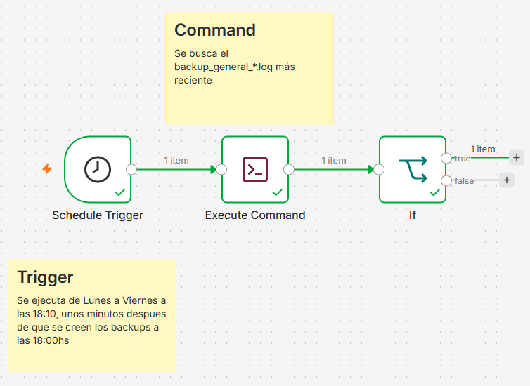
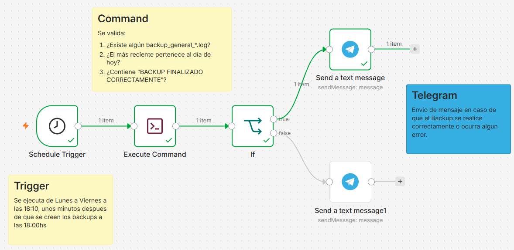
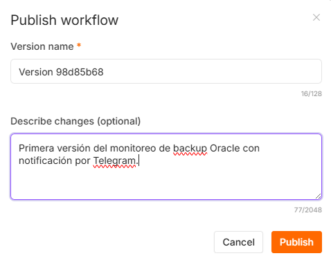

# Envio de Notificaciones con n8n

1. Creamos nuestro contenedor con el comando (ubicados en la carpeta donde se encuentra nuestro .yml):

```bash
docker compose up -d
```

y para ver si se creo correctamente ingresamos a:

```bash
http://localhost:5678
```

Para crear el Flujo necesitaba el bloque **Execute Command**, el cual es que va a ingresar a mi carpeta y este no estaba incluido por defecto en mi contenedor ya que hay que usarlo con cuidado, lo que hacemo es agregar a mi .yml la linea: 
```bash
- NODES_EXCLUDE=[]

# UNA VEZ AGREGADA, GUARDO EL ARCHIVO Y VUELVO A BAJAR Y SUBIR MI CONTENEDOR CON LOS COMANDOS:
docker compose down
docker compose up -d

## NOTA: ESTO NO ROMPE ABSOLUTAMENTE NADA, LUEGO REINICIO MI CONTENEDOR Y LISTO!!!
```

2. Creado el Flujo de trabajo



3. Configuramos Telegram para que envie notificaciones, para informar si el backup se realizo correctamente o si ocurrio algun error, para esto:  

* Crear un bot en Telegram, buscamos **BotFather** y elegimos el verficado (el primero)  
* Iniciar bot  
* Escribir **/newbot**   
* Aqui nos va a pedir:  
        name bot: Backup Oracle  
        username bot: backup_oracle_wick_bot
* Esto me va a generar un **Token**, el cual vamos a usar en n8n como credencial.

4. Ahora actualizamos el flujo de trabajo para que trabaje con Telegram.

* En telegram en **BotFather** ejecutamos **/mybots**  
* Entrar a **Backup Oracle**
* Ejecutar **/start**
* Luego entramos a https://api.telegram.org/botTU_TOKEN/getUpdates y de aqui sacamos el **Chat ID** el cual tenemos que copiar y pegar en nuestro nodo.

  

5. Ejecutamos y si no da ningun error, lo publicamos con el boton **Publish**. 

